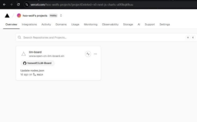
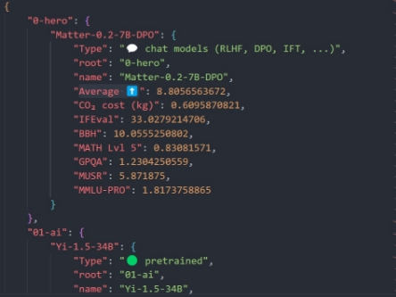
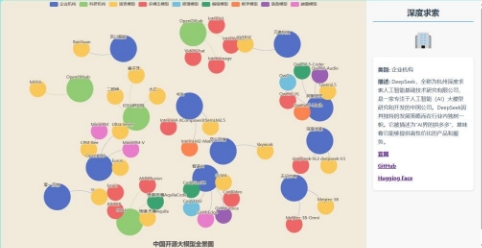
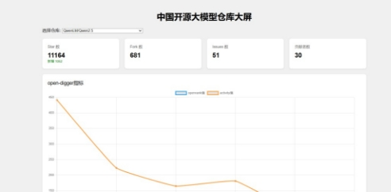
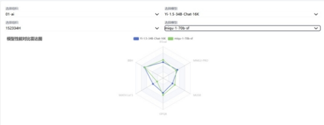
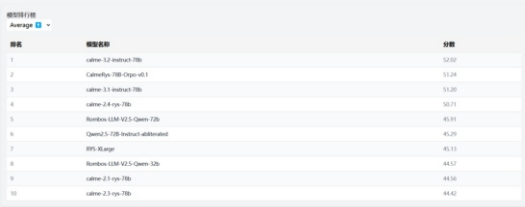

# LLM-Board
openrank-cup

![ref1]

**中国开源大模型全景图**

超级大香蕉

![ref2]
# **网站部署**
网站链接：[https://www.open-cn-llm-](https://www.open-cn-llm-board.xin/) [board.xin/](https://www.open-cn-llm-board.xin/)

![ref3]1.网站使用html,javascript,css搭建，即普通的的动态网页，不涉及后端，代码与数

据一同放在web文件夹下

上传github后，可以与[vercel](https://vercel.com/)（一个免费的网页部署网站）建立联系，并部署

在阿里云购买域名后，即可使用自己的域名进行访问

![ref2]
# **数据准备**

![ref3]1，仓库名获取

通过相关资料和网站，统计了以下有开源大模型的机构：

阿里巴巴，智谱AI，北京智源人工智能研究院（BAAI），OpenLMLab（复旦）， OpenBMB（面壁智能&清华大学），OpenGVLab（上海人工智能实验室），百川智能，IDEA研究院，元象科技，零一万物，昆仑万维，无问芯穹，书生（上海人工智能实验室），杭州deepseek。

从他们的官网和github,huggingface上获得开源模型的名称以及相关网址

并做成json格式，包含点和边（web/source/nodes.json），对组织机构搜集其简介

方便后续使用echarts画图

![ref3]2，opendigger数据与github api数据 opendigger用到的数据有:

openrank：开源影响力 activity：活跃度

stars:每月star的增加量

其中部分仓库会出现没有值的情况

通过根链接https://oss.open-digger.cn/github/{org/login}/{repo}/即可获得

仓库名先获得所有组织名，通过github api再获得所有仓库名

（function/get\_name.py）存到（web/source/org\_repos.json）中

再获得关于每个仓库star,fork,issue,contributors数

（function/update\_repo\_data.py）存到（web/source/repo\_data.json）中

![ref3]3，huggingface 数据

huggingface上有关与大模型评分的数据集open-llm-leaderboard/contents

可以用官方给的URL使用pandas进行调用，获得的数据处理为需要的格式

通过（function/llm\_content.py）存入（web/source/content.json）

![ref3]格式为



root和name方便进行特定查找

![ref2]
# **网站搭建及演示**
网站链接：[https://www.open-cn-llm-](https://www.open-cn-llm-board.xin/) [board.xin/](https://www.open-cn-llm-board.xin/)

![ref3]1，主页面(web/index.html)



设计三个主要板块，点击即

可跳转

右上方github图标也可点击，

跳转到项目仓库

其余按钮目前尚未实现，起装饰作用

![ref3]2，全景图(web/graph.html)



该全景图由echatrs力引导图为主要，同时用js为每个点增加点击事件

初始时，右边会显示一些基本信息，点击每个点后，会根据点的类别在右侧更新页面，对组织机构可以点击相应链接跳转

目前只有主要组织机构有详细信息

可以点击上方分类按钮进行筛选模型

![ref3]3，开源影响力(web/dashboard.html)

上方使用grid布局，使格式整齐。 通过前面获取的仓库名数据，实现一个下拉列表，选择github仓库后，上方的四个小窗和下方的折线图会动态更新，这里我选了大部分有数据的最近六个月，到2024-11为止，由日期标签，可以由opendigger根链接得到新增star，以及六个月的 openrank,activity值，对无效的网页或者没有数据，归为0处理，避免出现显示错误

![ref3]4，模型能力比较(web/radar.html)

页面上方是基本的指标说明和一

些基本信息，方便访问者理解

下方雷达图使用echarts画出，通过content中的数据，可以动态选择不同模型进行比较，并在雷达图中呈现

除了雷达图，还会在下方显示出各项指标的柱状图，更直观的研究单个模型的能力

![ref3]4，模型能力比较(web/radar.html)



除了比较两个模型，还在下方增设了排行榜，对每个指标进行排序，了解不同领域模型的差距

![ref2]
# **结语**

![ref3]在全球人工智能技术的竞争中，开源大模型不仅能够提升国内技术的国际影响力，还能帮助中国企业和研究机构在全球范围内建立话语权。通过开源，中国的技术标准和创新思路将得到更多国际认可，为全球AI生态的多元化发展贡献力量。

本项目虽然不能全面展示中国开源大模型的生态，但足以让每个人认识到中国开源大模型在全球的优势，技术层次的领先。

我们希望有越来越多的企业和机构参与到开源中来，为中国的AI发展贡献力量谢谢您的观看！

![ref1]**谢谢观看**

[ref1]: md_graphs/Aspose.Words.c59f8d14-be30-4297-a42c-cceb2ebd2ae2.001.jpeg
[ref2]: md_graphs/Aspose.Words.c59f8d14-be30-4297-a42c-cceb2ebd2ae2.003.jpeg
[ref3]: md_graphs/Aspose.Words.c59f8d14-be30-4297-a42c-cceb2ebd2ae2.005.jpeg
